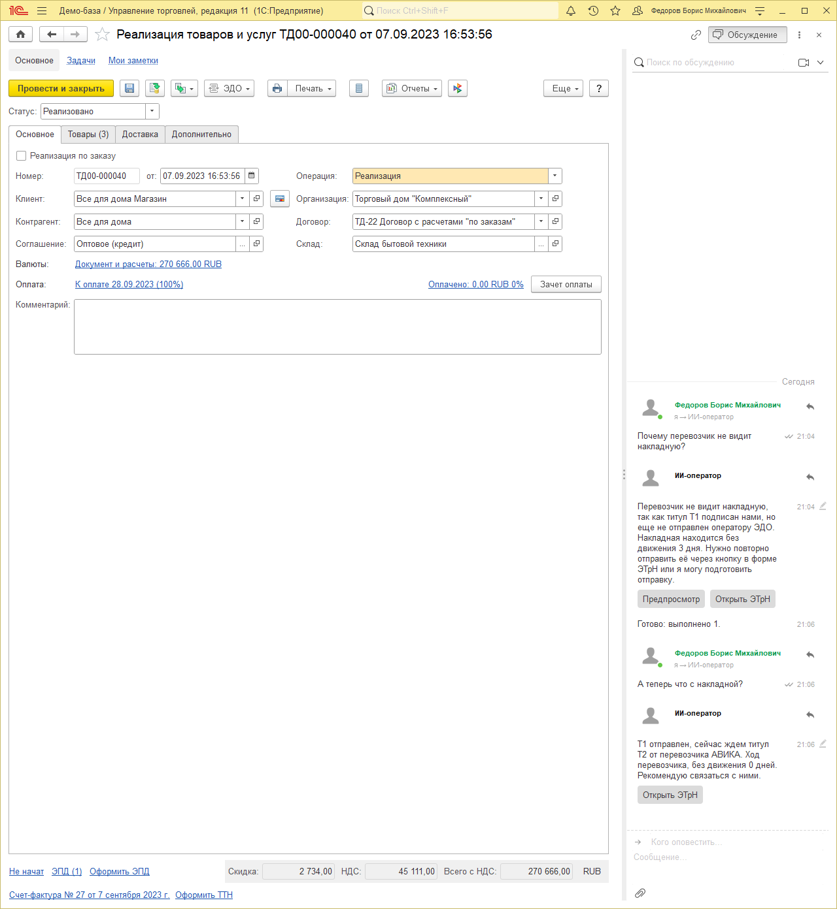
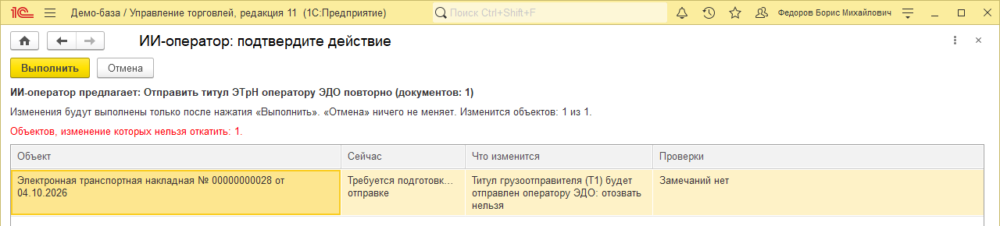
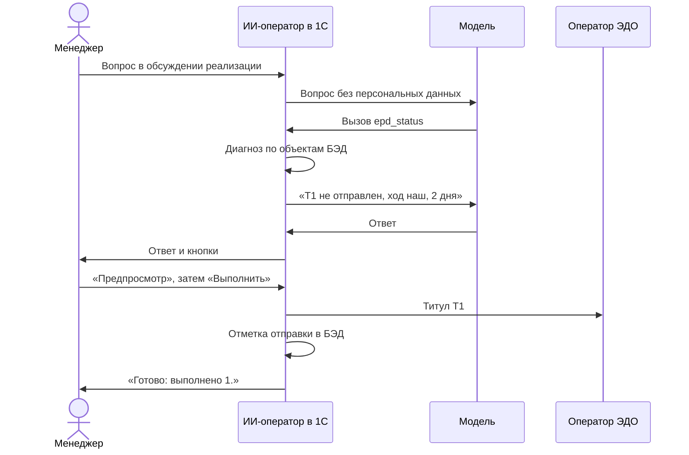

<p align="center"></p>

# ИИ-оператор: пакет для ЭТрН

**Пакет ИИ-оператора для электронных транспортных накладных в «1С:Управление торговлей 11.5».** Менеджер спрашивает в обсуждении реализации: «почему перевозчик не видит накладную?» Бот отвечает по данным электронного документооборота в базе: на каком титуле стоит перевозка, чей ход, сколько дней без движения и что сделать. Повторную отправку титула человек подтверждает кнопкой.

[](LICENSE)


<p align="center"></p>

[ИИ-оператор](https://github.com/RunetX/ai-operator-core) — агент внутри сеанса 1С пользователя: модель работает с правами этого пользователя и только через инструменты, а персональных данных не видит. Вопросы задают боту в обсуждении документа 1С или в чате MCP-клиента. Пакет добавляет к ядру инструменты ЭТрН для обоих каналов.

---

## Содержание

- [Как это выглядит](#как-это-выглядит)
- [Что знает диагноз](#что-знает-диагноз)
- [Как устроено](#как-устроено)
- [Инструменты](#инструменты)
- [Что нужно](#что-нужно)
- [Установка](#установка)
- [Тесты](#тесты)
- [Ограничения](#ограничения)
- [Лицензия](#лицензия)

---

## Как это выглядит

Ниже — ответы бота в обсуждениях реализаций демо-базы УТ. Модель — Gemma 4 26B в LM Studio на рабочем компьютере. Обмен с оператором ЭДО замокан.

**Титул не ушёл оператору.** Менеджер спрашивает бота «ИИ-оператор» в обсуждении реализации. Под ответом — кнопки «Предпросмотр» и «Открыть ЭТрН». После «Выполнить» в ветке появляется итог, а на следующий вопрос бот отвечает уже по новому состоянию:



«Предпросмотр» открывает у менеджера план: одна ЭТрН, «титул грузоотправителя (Т1) будет отправлен оператору ЭДО: отозвать нельзя». Изменение выполняется, только если он нажмёт «Выполнить»:



**Перевозка застряла у грузополучателя.**

> **Менеджер:** Почему ЭТрН по этой реализации до сих пор не закрыта?
>
> **ИИ-оператор:** Перевозка на титуле Т3, сейчас ход грузополучателя Альтаир. Грузополучатель не принял груз уже 6 дней (с 28.09.2026). Рекомендую связаться с ними.

**Контрагент отказал.**

> **Менеджер:** Перевозчик что-нибудь ответил по ЭТрН?
>
> **ИИ-оператор:** Перевозчик отклонил титул Т1 с причиной: Транспортное средство не подано под погрузку. Сейчас ход у нас, нужно открыть ЭТрН, исправить данные и оформить заново.

**Водитель в вопросе.** Менеджер пишет ФИО водителя полностью, а модель получает вместо него токен: «Водитель `[ФИО#1]` говорит, что груз сдал. Почему ЭТрН висит?» Ядро заменяет имя ещё до отправки вопроса, а человек в 1С видит ответ с настоящими именами.

> **ИИ-оператор:** Перевозка сейчас на титуле Т3 — ждем, когда грузополучатель Альтаир подтвердит приемку. Ход грузополучателя, без движения уже 6 дней.

Путь от вопроса до отправки:



## Что знает диагноз

Диагноз ставит код пакета, а не модель. Модель только пересказывает готовый текст, поэтому причин не выдумывает.

| Состояние | Чей ход | Что предлагает бот |
| --- | --- | --- |
| Титул Т1 не сформирован или не подписан | наш | Открыть ЭТрН и отправить из формы |
| Т1 не ушёл оператору ЭДО | наш | Повторить отправку: кнопка «Предпросмотр» |
| Оператор вернул временную ошибку | наш | Повторить отправку |
| Оператор вернул блокирующую ошибку, например пустой КПП | наш | Открыть ЭТрН и исправить данные |
| Перевозчик или грузополучатель отказал | наш | Исправить по причине отказа и оформить заново |
| Ждём титул перевозчика о приёме груза (Т2) | перевозчика | Связаться с перевозчиком |
| Ждём титул грузополучателя (Т3) | грузополучателя | Связаться с грузополучателем |
| Ждём титул перевозчика о выдаче груза (Т4) | перевозчика | Связаться с перевозчиком |
| Перевозка завершена | — | — |

В каждом ответе есть контрагент, дата последнего движения и число дней без движения, а при ошибке или отказе — их причина.

## Как устроено

- **Настоящие объекты БЭД.** Пакет ищет ЭТрН по документу-основанию: реализации, отгрузке, перемещению, заданию на перевозку. Затем читает сообщения ЭДО по титулам Т1–Т4, отказы, состояние электронного документа и ошибку оператора. Служебные функции БЭД для чтения пакет не вызывает: их состав меняется между релизами. Если нужных объектов БЭД в конфигурации нет, пакет свои инструменты не регистрирует.
- **Устойчивость к новым релизам.** Состояния документа сводятся в группы по корню имени значения перечисления БЭД. Новое значение в следующем релизе попадает в свою группу и не ломает диагноз.
- **Права пользователя.** Доступ к ЭТрН проверяется запросом с `РАЗРЕШЕННЫЕ`. Сообщения и регистры ЭДО читаются привилегированно, так же как их читает сама БЭД.
- **Персональные данные не уходят модели.** ФИО и удостоверение водителя хранятся в значениях титула. Пакет их модели не отдаёт, а ядро скрывает их и в тексте ошибки оператора, и в причине отказа. Макет `ИИОЭ_ПреднастройкаМаскирования` закрывает от запросов модели значения титулов ЭПД и данные водителей мобильного приложения.
- **Изменения — только кнопкой человека.** Повторная отправка — действие `epd_send` ядра. Модель готовит план, пользователь видит его в форме предпросмотра и нажимает «Выполнить». Обращение к оператору идёт до транзакции, отметка в БЭД — в транзакции. Отправку не отменить: принятый оператором титул не отзывается.

## Инструменты

| Инструмент | Что делает | Кто меняет данные |
| --- | --- | --- |
| `epd_status` | Состояние ЭТрН по реализации или по самой ЭТрН: титулы Т1–Т4 со статусами, диагноз (код, чей ход, контрагент, дни без движения, причина), действие. В боте добавляет кнопки «Открыть ЭТрН» и «Предпросмотр» | — |
| `perform` с `action: epd_send` | Повторная отправка титула грузоотправителя оператору ЭДО через предпросмотр ядра | пользователь кнопкой «Выполнить» |

`epd_send` по умолчанию запрещено. Администратор разрешает его в регистре «Разрешения действий ИИ-оператора», так же как действия ядра: см. [«Разрешения действий»](https://github.com/RunetX/ai-operator-core/blob/main/docs/install.md#разрешения-действий) в инструкции ядра.

Описания инструментов для модели — в макете `ИИОЭ_ОписанияИнструментов`, инструкции бота — в `ИИОЭ_ОписанияАгента`.

## Что нужно

- «1С:Управление торговлей 11.5» с БЭД 1.9.16. Проверено на УТ 11.5.27.93.
- Платформа 8.3.24 или новее. Проверено на 8.3.27.
- [Ядро ИИ-оператора](https://github.com/RunetX/ai-operator-core) 0.1.14 или новее: в нём точки расширения пакетов для бота и для действий. Ядро в этот репозиторий не входит.
- Для вопросов в обсуждениях 1С — канал «бот» из репозитория ядра.
- PowerShell 7 для скриптов сборки и тестов. Python 3.11+ — для мока оператора.
- Для тестов — YAxUnit 25.12.

## Установка

**Проще всего — установочная обработка ядра.** Скачайте `ai-operator-installer-<версия>.epf` из [релизов ядра](https://github.com/RunetX/ai-operator-core/releases), откройте базу под администратором и выберите обработку через «Файл → Открыть». Она поставит ядро и совместимую версию этого пакета, если пакет подходит конфигурации, — подробнее в [инструкции ядра](https://github.com/RunetX/ai-operator-core/blob/main/docs/install.md#2-установка-в-базу).

Вручную: сначала установите в базу ядро ИИ-оператора по его [инструкции по развёртыванию](https://github.com/RunetX/ai-operator-core/blob/main/docs/install.md). Готовые `.cfe` ядра и бота для УТ 11.5 — в [релизах ядра](https://github.com/RunetX/ai-operator-core/releases), пакета — в [Releases](https://github.com/RunetX/ai-operator-epd/releases) этого репозитория: загрузите их в конфигураторе («Конфигурация → Расширения конфигурации» → «Добавить» → «Загрузить из файла») и снимите флажки «Безопасный режим» и «Защита от опасных действий».

Или соберите пакет из исходников: скрипт загрузит его в ту же файловую базу. Клиент 1С на этой базе нужно закрыть.

```powershell
./build.ps1 -InfoBase 'C:\Bases\Trade' -User 'Администратор'
```

Скрипт приводит исходники к формату выгрузки конфигуратора, загружает расширение через `ibcmd` и выключает для него безопасный режим и защиту от опасных действий, как у ядра. Если пароль задан, передайте его параметром `-Password`. Платформу можно указать параметром `-Platform 8.3.24.1342`.

Клиент с моделью видит `epd_status` вместе с инструментами ядра. Если клиент был подключён раньше, переподключите его: список инструментов клиенты запоминают при подключении.

## Тесты

В расширении «ИИОператор_ЭПД_Тесты» 26 тестов YAxUnit. 13 проверяют диагностику на состояниях в памяти. Остальные создают ЭТрН генератором `ОМ_ИИОЭ_ГенераторЭТрН` и проверяют путь до `epd_status` и `epd_send`.

Генератор создаёт ЭТрН так же, как это делает БЭД:
- значения заполнения по реализации;
- запись документа;
- штатное «Сформировать» Т1.

Дальше он доводит её до нужного состояния: отправка, входящие титулы перевозчика и грузополучателя, отказ, ошибка оператора. Для этого генератор пишет синтетическую учётную запись ЭДО, настройки отправки и приглашения. Чего нет в демо-данных, например веса товара или индекса адреса, он подставляет.

```powershell
./build.ps1 -InfoBase 'C:\Bases\Trade' -User 'Администратор' -Tests
./test.ps1 -InfoBase 'C:\Bases\Trade' -User 'Администратор'
```

- Тесты работают в транзакции и откатывают её. Нужна проведённая реализация с адресом доставки покупателю-юрлицу без ЭТрН.
- Расширение с тестами ставьте только в копию базы. Генератор умеет и наполнить базу ЭТрН во всех состояниях (`ОМ_ИИОЭ_ГенераторЭТрН.НаполнитьСтенд`). Это меняет данные, поэтому делайте так только на демо-копии.
- «Выполнить» в предпросмотре тесты не нажимают: подтверждение они передают серверу ядра так же, как тесты самого ядра.

**Мок оператора** — `tests/mock/edo_mock.py`, проверки — `tests/mock/test_edo_mock.py`. Мок принимает отправку титула и отвечает «принято», временной ошибкой или блокирующей ошибкой, а также ведёт журнал.

## Ограничения

- **Отправка только на тестовый сервер.** Транспорт отправляет титул на тестовый сервер оператора (мок), адрес которого задан в константе `ИИОЭ_АдресТестовогоСервераОператораЭДО`. Без адреса предпросмотр сообщает, что титул нужно отправить из формы ЭТрН («Отправить через ЭДО»). Штатная отправка через 1С-ЭДО из ИИ-оператора не сделана: нужно подписание сертификатом.
- **Только исходящие ЭТрН грузоотправителя.** Входящие ЭТрН и роли перевозчика и грузополучателя диагноз пока не разбирает: ответ — «состояние не разбирается, смотрите форму ЭТрН».
- **Чего диагноз не учитывает.** История действий по ЭДО, срок сертификата и признак «давно ничего не приходило от оператора» в диагноз не входят.
- **Хрупкость между релизами БЭД.** Пакет опирается на метаданные БЭД: документ ЭТрН и его табличную часть оснований, сообщения ЭДО, регистры связи с объектами учёта, состояний и ошибок передачи, перечисления типов элементов регламента и состояний. Отметка отправки на тестовом сервере вызывает служебные функции БЭД пересчёта состояния. При изменении этих объектов в новом релизе пакет нужно проверить заново.

## Лицензия

[MIT](LICENSE).

Пакет не является продуктом фирмы «1С». 1С и другие упомянутые названия — товарные знаки их правообладателей.
